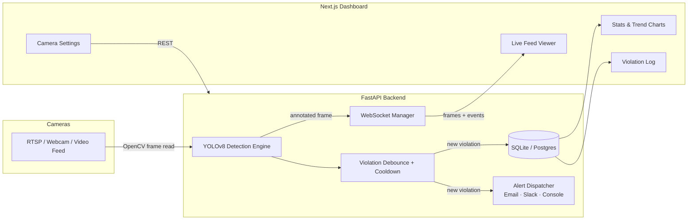

# 🦺 PPE Compliance Detection System

**Real-time computer-vision safety monitoring that detects missing Personal Protective Equipment (hard hats, safety vests, masks) on live camera feeds, logs violations, and alerts safety officers instantly.**

Built with YOLOv26m, FastAPI (WebSockets), and Next.js.

---

## 🎯 The Problem

Workplace injuries on construction and industrial sites are still overwhelmingly caused by PPE non-compliance. Per OSHA, thousands of preventable injuries and fatalities happen every year because a worker wasn't wearing a hard hat or safety vest in a hazard zone — and manual supervision doesn't scale across a large site with dozens of workers and multiple entry points.

**This system automates that supervision**: it watches existing CCTV/RTSP cameras 24/7, detects PPE violations in real time, logs every incident with a timestamped snapshot, and pings the safety team (email/Slack) the moment someone enters a zone without required gear — turning a reactive, after-the-fact safety process into a proactive one.

---

## ✨ Features

- **Real-time detection** — YOLOv8 object detection on live RTSP/webcam/video feeds via WebSocket streaming (no page refresh, no polling)
- **Multi-camera support** — monitor multiple site entrances/zones simultaneously from one dashboard
- **Smart violation logging** — debounced detection (ignores single-frame flicker) with a cooldown window to avoid duplicate alerts for the same ongoing violation
- **Multi-channel alerts** — console, email (SMTP), and webhook (Slack/Discord/Teams compatible) — configure any subset
- **Live analytics dashboard** — compliance rate, violation trend charts, per-camera and per-type breakdowns
- **Violation history & audit log** — filterable table with resolve/acknowledge workflow
- **Camera management UI** — add/remove/toggle camera sources from the dashboard, no redeploy needed
- **Bring-your-own model** — ships with stock YOLOv8n for instant demo; includes a training script to fine-tune on your own PPE dataset for production accuracy
- **Fully dockerized** — `docker-compose up` and you're monitoring
- **Tested REST API** — pytest suite covering the core endpoints

---

## 🏗️ Architecture



**Data flow:** a background loop reads frames from each active camera → YOLO detects PPE classes (hardhat, vest, mask + their "NO-" violation counterparts) → detections stream over WebSocket to any dashboard viewing that camera → a violation seen for N consecutive frames gets logged to the database and triggers alerts (respecting a cooldown so one ongoing violation doesn't spam the channel) → the dashboard's stats/violations pages read from the same database via REST.

---

## 🛠️ Tech Stack

| Layer | Technology |
|---|---|
| Object Detection | YOLOv8 (Ultralytics), OpenCV |
| Backend API | FastAPI, WebSockets, SQLAlchemy |
| Database | SQLite (default) — swap `DATABASE_URL` for Postgres in production |
| Frontend | Next.js 14 (App Router), TypeScript, Tailwind CSS, Recharts |
| Alerts | SMTP email, generic webhook (Slack/Discord/Teams) |
| Deployment | Docker, Docker Compose |
| Testing | Pytest |

---

## 📁 Project Structure

```
ppe-compliance-system/
├── backend/
│   ├── app/
│   │   ├── main.py              # FastAPI app + router registration
│   │   ├── config.py            # Env-driven settings
│   │   ├── detection.py         # YOLO inference + frame annotation
│   │   ├── alerts.py            # Email / webhook / console alert dispatch
│   │   ├── websocket_manager.py # Per-camera WS broadcast
│   │   ├── database.py / models.py / schemas.py
│   │   └── routers/             # detect, cameras, violations, stats, ws
│   ├── train/train_model.py     # Fine-tune YOLOv8 on your own PPE dataset
│   ├── tests/test_api.py
│   ├── requirements.txt
│   └── Dockerfile
├── frontend/
│   ├── src/app/                 # dashboard, violations, settings pages
│   ├── src/components/          # LiveFeed, StatsCard, charts, tables
│   ├── src/lib/ + src/hooks/    # API client, WebSocket hook, types
│   └── Dockerfile
├── scripts/demo.py              # Standalone OpenCV-window demo (no server needed)
├── docker-compose.yml
└── README.md
```

---

## 🚀 Quick Start

### Option A — Docker (recommended)

```bash
git clone https://github.com/aasimjaved/ppe-compliance-system.git
cd ppe-compliance-system
docker-compose up --build
```

- Dashboard: http://localhost:3000
- API docs (Swagger): http://localhost:8000/docs

Add a camera from the **Settings** page — use `0` for your default webcam, a file path for a sample video, or an `rtsp://` URL for a real CCTV feed.

### Option B — Run locally

**Backend:**
```bash
cd backend
python -m venv venv && source venv/bin/activate   # Windows: venv\Scripts\activate
pip install -r requirements.txt
cp .env.example .env
uvicorn app.main:app --reload
```

**Frontend:**
```bash
cd frontend
npm install
cp .env.local.example .env.local
npm run dev
```

**Standalone demo (no servers, just a window):**
```bash
python scripts/demo.py --source 0
```

---

## 🧠 Training Your Own PPE Model

The system ships with stock `yolov8n.pt` (COCO weights) so it runs immediately — but that only reliably detects `person`, not PPE items. For real accuracy, fine-tune on a PPE-labeled dataset:

1. Download a PPE dataset in YOLOv8 format — e.g. Roboflow's public **"Construction Site Safety"** dataset (classes: `Hardhat`, `Mask`, `NO-Hardhat`, `NO-Mask`, `NO-Safety Vest`, `Person`, `Safety Vest`, etc.)
2. Train:
   ```bash
   cd backend/train
   pip install ultralytics
   python train_model.py --data /path/to/data.yaml --epochs 100 --device 0
   ```
3. Copy the resulting `best.pt` into `backend/` and set `MODEL_PATH=best.pt` in `backend/.env`.

The detection engine (`app/detection.py`) already knows how to color-code and log the standard PPE class names — no code changes needed after swapping the model.

---

## 📡 API Reference

| Method | Endpoint | Description |
|---|---|---|
| `POST` | `/api/detect` | Run detection on a single uploaded image |
| `GET` | `/api/cameras` | List configured cameras |
| `POST` | `/api/cameras` | Add a camera |
| `PATCH` | `/api/cameras/{id}/toggle` | Enable/disable a camera |
| `DELETE` | `/api/cameras/{id}` | Remove a camera |
| `GET` | `/api/violations` | List violations (filterable by camera/type/resolved) |
| `PATCH` | `/api/violations/{id}/resolve` | Mark a violation as resolved |
| `GET` | `/api/stats/summary` | Dashboard KPIs + 7-day trend |
| `WS` | `/ws/live/{camera_id}?source=...&name=...` | Live annotated frame + violation event stream |

Full interactive docs at `/docs` once the backend is running.

---

## ⚙️ Configuration

All backend settings are environment-driven — see `backend/.env.example`:

- `MODEL_PATH` — path to your `.pt` weights
- `CONFIDENCE_THRESHOLD`, `IOU_THRESHOLD` — detection tuning
- `VIOLATION_FRAME_THRESHOLD` — consecutive frames before a violation is logged (debounce)
- `VIOLATION_COOLDOWN_SECONDS` — minimum gap between repeat alerts for the same ongoing violation
- `SMTP_*` / `ALERT_EMAIL_TO` — email alerts
- `WEBHOOK_URL` — Slack/Discord/Teams incoming webhook

---

## 🧪 Testing

```bash
cd backend
pytest tests/ -v
```

---

## 🗺️ Roadmap

- [ ] Role-based auth for the dashboard (site admin vs. safety officer views)
- [ ] Postgres + Alembic migrations for production deployments
- [ ] Per-zone rules (e.g. require vest only in vehicle zones)
- [ ] Mobile push notifications
- [ ] ONNX/TensorRT export for edge deployment (Jetson/Raspberry Pi)
- [ ] Heatmap of violation hotspots per site

---

## 📄 License

MIT — see [LICENSE](LICENSE).

## 👤 Author

**Asim Javed** — AI/ML Engineer (Computer Vision)
[GitHub](https://github.com/aasimjaved)
